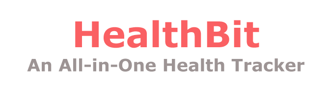
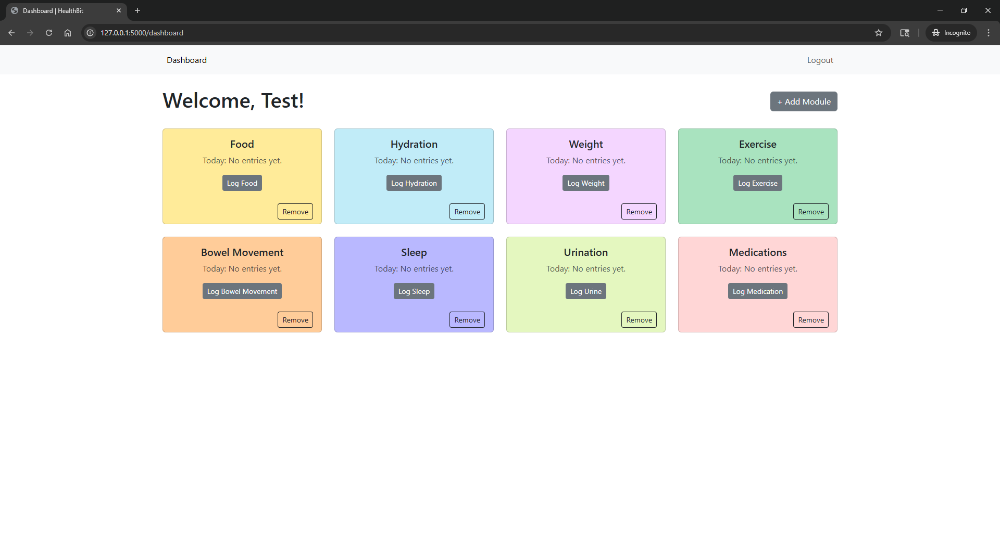
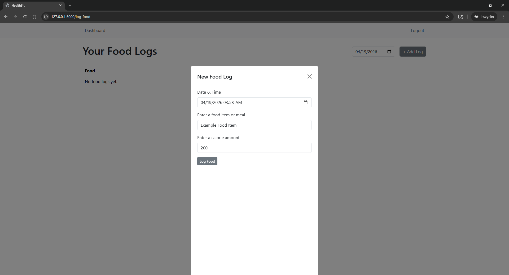

[![Contributors][contributors-shield]][contributors-url]
[![Stargazers][stars-shield]][stars-url]
[![Issues][issues-shield]][issues-url]

<!-- PROJECT LOGO -->
<br />
<div align="center">
  <a href="https://github.com/AnnaVo0/HealthBit">
    
  </a>

<h3 align="center">HealthBit: An All-in-One Health Tracker</h3>

  <p align="center">
    Never fumble around looking for another health tracker app. Now supports health tracking for food, hydration, weight, exercise, bowel movement, sleep, urination, and medication logging.
    <br />
    <br />
    <a href="https://github.com/AnnaVo0/HealthBit/issues/new?labels=enhancement&template=feature-request---.md">Request Feature</a>
  </p>
</div>

<!-- ABOUT THE PROJECT -->
## About The Project

View installation steps below and use the app for yourself! Currently supports up to 8 different health modules for tracking.




<p align="right">(<a href="#readme-top">back to top</a>)</p>


### Built With

* [![Flask][Flask-logo]][Flask-url]
* [![Bootstrap][Bootstrap-logo]][Bootstrap-url]

<p align="right">(<a href="#readme-top">back to top</a>)</p>


<!-- GETTING STARTED -->
## Getting Started

Installation is seamless and easy using `pip`.

### Prerequisites

* Make sure `pip` is installed.

### Installation

1. Clone the repo
   ```sh
   git clone https://github.com/AnnaVo0/HealthBit.git
   ```
2. Move to `HealthBit` if not in the project folder
   ```sh
   cd HealthBit
   ```
3. Install packages
   ```sh
   pip install -r requirements.txt
   ```
4. Run a local dev server to check out the project
   ```
   python app.py
   ```
   or
   <br />
   ```
   flask run
   ```
<p align="right">(<a href="#readme-top">back to top</a>)</p>

<!-- USAGE EXAMPLES -->
## Usage

Users may enter logs on every module page, and have their data persistently kept across sessions.



<p align="right">(<a href="#readme-top">back to top</a>)</p>

### Top contributors:

<a href="https://github.com/AnnaVo0/HealthBit/graphs/contributors">
  
</a>

<!-- ACKNOWLEDGMENTS -->
## Acknowledgments
Authors
* [Devon Elmes](https://github.com/devonelmes)
* [George Stewart](https://github.com/george-sx)
* [Anna Vo](https://github.com/AnnaVo0)
* [Aya Ba Alawi](https://github.com/ayabaalawi)

<p align="right">(<a href="#readme-top">back to top</a>)</p>


<!-- MARKDOWN LINKS & IMAGES -->
<!-- https://www.markdownguide.org/basic-syntax/#reference-style-links -->
[contributors-shield]: https://img.shields.io/github/contributors/AnnaVo0/HealthBit.svg?style=for-the-badge
[contributors-url]: https://github.com/AnnaVo0/HealthBit/graphs/contributors
[stars-shield]: https://img.shields.io/github/stars/AnnaVo0/HealthBit.svg?style=for-the-badge
[stars-url]: https://github.com/AnnaVo0/HealthBit/stargazers
[issues-shield]: https://img.shields.io/github/issues/AnnaVo0/HealthBit.svg?style=for-the-badge
[issues-url]: https://github.com/AnnaVo0/HealthBit/issues
[Flask-logo]: https://img.shields.io/badge/Flask-20232A?style=for-the-badge&logo=Flask&logoColor=3BABC3
[Flask-url]: https://flask.palletsprojects.com/en/stable/
[Bootstrap-logo]: https://img.shields.io/badge/Bootstrap-20232A?style=for-the-badge&logo=Bootstrap&logoColor=7952B3
[Bootstrap-url]: https://getbootstrap.com/